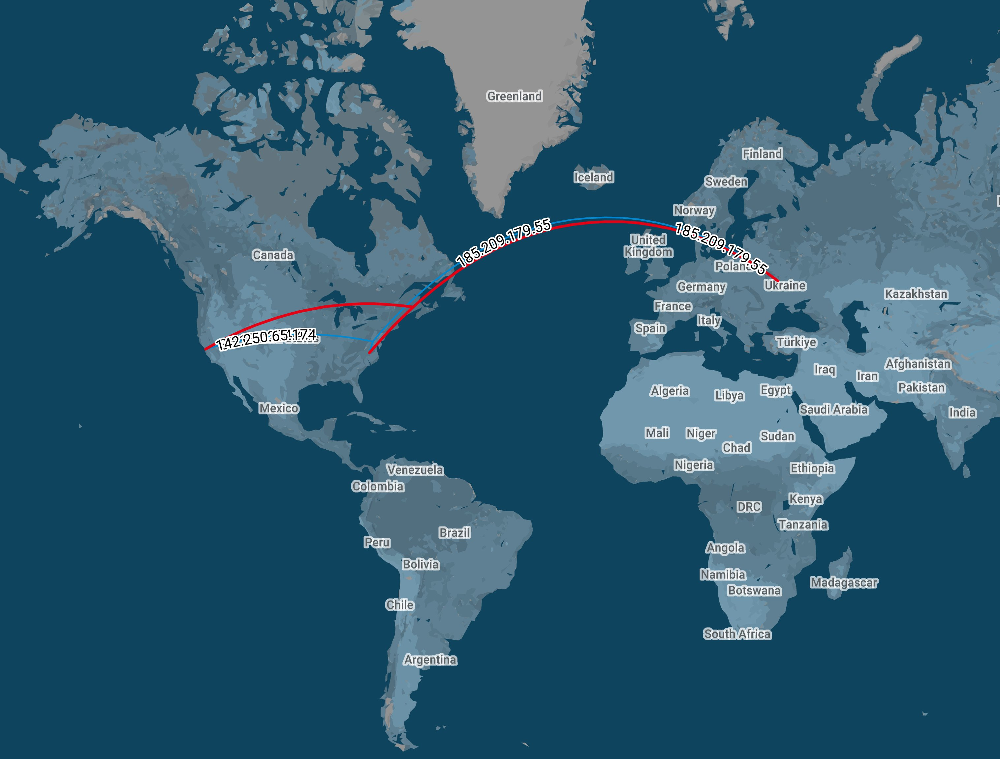

# packetTracking - Plot IPs with GeoIP data using KML format
 
This Python code reads a network traffic capture file in pcap format (Packet Capture Data) using Wireshark, and extracts the source and destination IP addresses of each packet. Then, it uses the GeoIP database to retrieve location information (longitude and latitude) of each IP address. Finally, it creates a KML (Keyhole Markup Language) file containing the coordinates of each IP address, which can be used to display the IP addresses on a map.

## Dependencies
The following Python packages are required to run this code:
- dpkt
```sh
pip install dpkt
```
- socket
- pygeoip
```sh
pip install pygeoip
```

## Usage
Download the GeoLiteCity.dat file by download a zip file from github (https://github.com/mbcc2006/GeoLiteCity-data.git)
<br> Put the GeoLiteCity.dat file in the same directory as the Python script
<br> Execute the main function using Python 3

## Output
The output of the script is a KML file named output.kml. The KML file contains placemarks for each IP address with the following information:
- Longitude and latitude of the destination IP address (as the end point of the line)
- Longitude and latitude of a source IP address (as the start point of the line)

Attached below is a visual representation of the IP tracking generated by this script &darr;



## License
This code is released under the MIT License.
